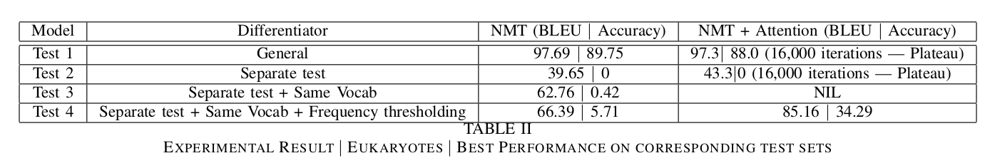

# Week Ten and Eleven | Stage 5 | Attention!

## Current Status

- The pipeline was finalized and automated.(Done)
- Report with all useful experiments was submitted (Done). Summary table:

- Refactoring the code (Done)
- Blog (Done)
- Even though i was able to reach an 85 BLEU score, the F1 score was very low. Cause sometime entities were mismatched. Like: Abstract and Manufacture! Suggestion: External embeddings
- The attention model feature of the NMT seem to be very useful for the compositionality special test done. One of the possible reasons can be that the test set only contained long compositionality based examples. 
- I read the paper suggested by Tommaso on Slack: https://arxiv.org/abs/1906.09302, The paper was a very nice survey on all the models and datasets. And the results stated there encouraged me to test the attention models and the results were dramatically improved.

## Work next week

- The buffer period will be used to form more questions using the generalized template generation methodology built in the previous stages and testing on standard benchmarking datasets.

- The report generated gave a brief information about the experimental setup and the results obtained in the work done in the project till now. We can further look into LC-QuAD and DBNQA to get more question templates using the generalized templated creation mechanism proposed in the report. (For 1 subject entity)
  
- I believe that putting all the mentioned filtering methodologies together and building a model on complete dbpedia might yield us a good complete product. Like the Eukaryotes based Q and A portal developed earlier as part of the project.

### [Index Page](https://anandpanchbhai.com/A-Neural-QA-Model-for-DBpedia/)

