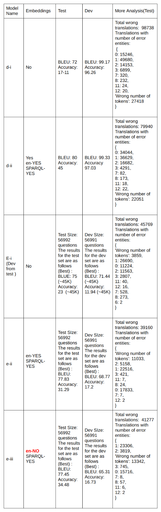

# The training week | The Results

## TL;DR

Two directions were suggested by the mentors in the last meeting:
- One was to continue using the RDF2Vec embedding and record all the results thus ending the GSoC project there
- Second being to explore the area of fasttext for training the embeddings.

Looking at the time constraints it is not possible to look into something new and finish all the while maintaining quality. The work will be hasty and not upto the mark.
- Each experiment approximately took:
    - Institute server: ~ 1 day 20 hours
    - GCP: ~4 hours
     
### Tests on the Person data

New tests were done on the person dataset. The following results were found:(attention: attention scaled luong)

### [Index Page](https://anandpanchbhai.com/A-Neural-QA-Model-for-DBpedia/)
