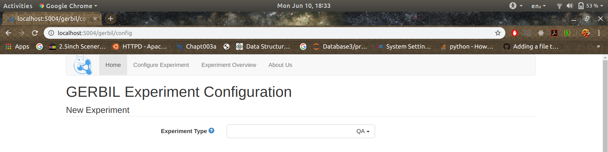
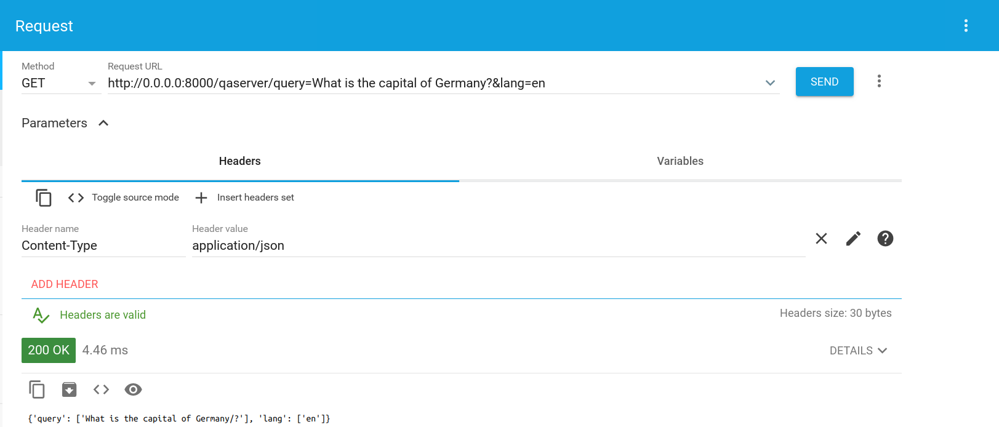

# Week Four and Five | Stage 1 & 2 | The Coding Begins

## Revelation

Huh!, it's been 5 weeks, Now I am able to sense the importance of this project and the inputs expected from me. Till now I have only worked on the weekends for a few hours. But I see now that this approach will not work.

The project demands more commitment from my side, it's working as intended is going to make a huge difference and the possibility of a research paper makes it much more challenging project. In the last meeting I could see that even after a detailed proposal you need to work furthermore to make things happen and work as you want them to, the mentors have been very patient and supportive and I appreciate it. I will be devoting a larger part of my time towards this project, because I really want to contribute in a meaningful manner.

Feelings of this revelation apart let's dive into what was done this week ;D.

---

## Work Done

### GERBIL

The introduction of this software:

>> This is GERBIL(http://gerbil-qa.aksw.org/gerbil/). All your peanuts belong to me! We present GERBIL QA, an extension of the general entity annotation system GERBIL. It offers an easy-to-use web-based platform for the agile comparison of QA systems using multiple datasets and uniform measuring approaches.

This platform is to be used to carry out F1 score related evaluation in this project.

GERBIL on local

I faced certain issues with the online version available on http://gerbil-qa.aksw.org/gerbil/, thus i decided to clone the repository of GERBIL and run it on my own local PC. I am still in the process of making it properly work on my PC.

To work in combination with GERBIL I also built a neural-qa django server to which a get request can be sent as per the guidelines in: https://github.com/dice-group/gerbil/wiki/Question-Answering.

QA - Server

---

### Performance of the current model

The tests were first run on the example file given in the data subfolder GS_v3.csv(https://github.com/dbpedia/neural-qa/blob/master/data/GS-v3.csv). The test was run multiple times, the BLEU score varied from 65-78. The log files will be uploaded for reference. As GERBIl platform was not ready to be used: the F1 scores could not be calculated.

In the meeting Tommaso Soru suggested to look deeper in the way the model is converging to get a better insight of the shortcomings of the model and to devise methods to improve them.

---

### Discussion for the next stage

I will implement the final workflow as mentioned in the: _Generating domain independent templates to minimize burden on the end user_ - section of my proposal and then more discussion will be done in the next meeting.

### Other methodology

I had second thoughts regarding feasibility of this approach cause a few main issues with the current approach were:

- The model was able to generate the correct query structure but at times failed to use correct entity URI. We pondered about using a seperate algorithm for entity detection.

- Given the vast size of DBpedia it seems preposterous that the model might actually remember all the entity and corresponding URI matching.

The 2 issues are very valid, but as part of this project it is important to understand that NsPM tries to build an end-to-end system for tackling the major goal of this project: efficient translation of NLP to SPARQL.

- Entity recognition extensively depends on the context and a separate algorithm might just make the process more error prone.
- Neural Network have shown their usefulness in more vague scenarios like object detection from images, thus even though they always seem counterintuitive, exploring these areas properly is the right thing to do.

Thus, we decided to stick to the proposal and the principle of NsPM: an end-to-end system.

---

### Conclusion

Real coding begins now and I cannot wait to see what the results are gonna come out to be, Work for the next week

- Fixing the issues with GERBIL
- Finalising the qa-server
- Push all the changes to the repository properly
- Update the blogs
- Generating domain independent templates to minimize burden on the end user for both complex and simple QA.

### [Index Page](https://anandpanchbhai.com/A-Neural-QA-Model-for-DBpedia/)
