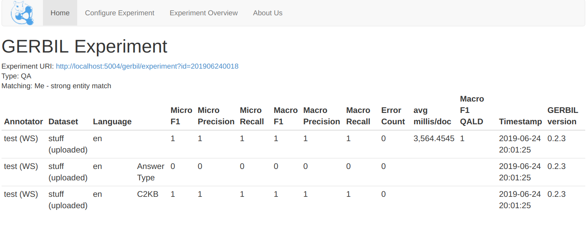
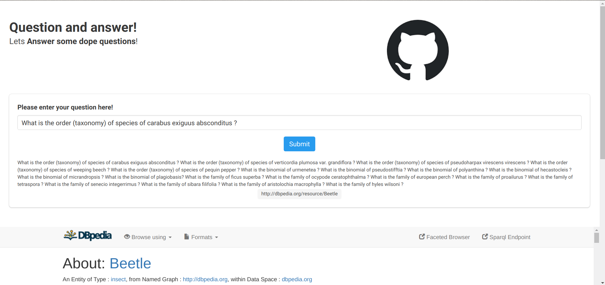
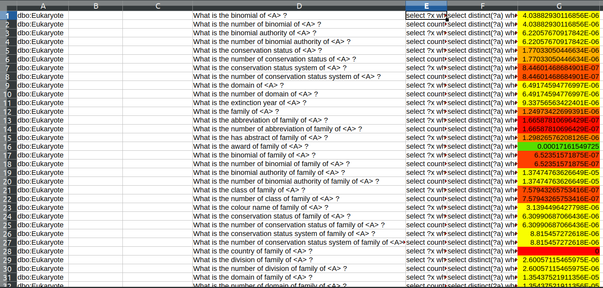

# WeekSeven | Stage 3 | Looking Beyond: making questions more human

Pretty cool week! Here are the tasks I was upposed to accomplish this week:

- Fixing the issues with GERBIL [Done]
- F1 Score [Done]
- More compositionality based on the mentor’s suggestions.
  - Make questions more natural and near to what people will really ask. [Done |  New ranking proposed ]
- Make the model learm for a longer time. [Not Done]

## Fixing the issues with GERBIL & F1 Score

Boy!, this was a task that I had to carry on for weeks as undone in my meeting. Finally it is completed and working like a charm, it's a bit slow but working!

Apart from that here is a poratl I made for Q&A, its pretty nice. I don't have a static public IP will try to host it somewhere:

## More on compositionality based on the mentor’s suggestions

### Brain Storming

This came out to be an interesting week with me diving in deep in thoughts regarding what methods to use to tackle the problem that arised in the previous meeting, which was:

>> The question seem to be useful but, they are at times nonsensical and grammatically incorrect. Thus they donot represnt real questions that the end system will encounter.

By going through many iterations of experiment I came down to one method of ranking that seemed most feasible and could generate visible results:
>> Hypothesis: Relevance of template can be determined by the popularity of the corresponding answers.

I proposed a ranking mechanism similar to the google page Rank for this purpose.

An important observation that I saw was that the ranking when done the threshold should be decided classwise and thus a single general threshold should not be used. Because the pages related to biology are seen fairly less than pages related to celebrities. But the relative number of views withing biology related pages is useful to us. Here is an example of another class:

## Change Log:

- In the previous implementation, I was using labels to differentiate the different entities, instead now I use the entity names as obtained from the properties page.

- Will update Further after the meeting.

### [Index Page](https://anandpanchbhai.com/A-Neural-QA-Model-for-DBpedia/)

