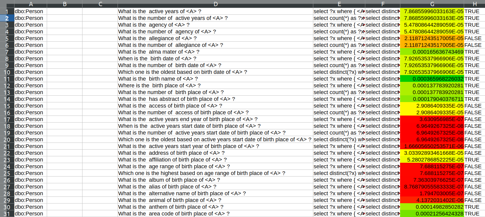

# WeekSeven | Stage 3 | Looking Beyond: making questions more human

## Brain Storming

This came out to be an interesting week with me diving in deep in thoughts regarding what methods to use to tackle the problem that arised in the previous meeting, which was:

>> The question seem to be useful but, they are at time nonsensical and grammatically incorrect. Thus they donot represnt real questions that the end system will encounter.

So, it was time to get back to analysing what could be done!, lets first bring all ideas that came up in the meeting together:


Some of the suggestions given by the mentors in the previous meeting were:

- Using Pre-Trained embeddings (Not very clear)
- Knowledge graph tokens
- Try classifying the natural language questions(english questions here) as natural and non-natural
- Google API to look for trends
- Manual Grammer correction
- Automated Grammer correction (Some mentors disagreed)

I also remember thar the previous developer's proposal had some mechanism through which he was trying to get the importance of the entities, When I read his proposal again. I came across these points which seemed useful:

- Property with no training examples(more learning opportunity)
- Rank based using: [http://atzori.webofcode.org/projects/rankProperties/](http://atzori.webofcode.org/projects/rankProperties/) - When I tried to make use of it. It seemed very difficult to use. The links to supporting research papers were not present too.
- Preventing using duplicate properties
- The class which has maximum number of example entries in DBpedia will be more important to be trained (because quantitatively and intuitively it holds maximum information that can be queried)
- Certain pruning stratergies.

The most important of all were some links posted by Tommaso Soru in slack:
>> this is a list of KGE approaches: https://gist.github.com/mommi84/07f7c044fa18aaaa7b5133230207d8d4

>> this is a pre-trained embedding model for DBpedia 2016-04: https://zenodo.org/record/1320038#.XQfS4XvTV25

Though I was not able to download the accompanying dataset in the second one, the supporting paper was really useful. The paper talked about biased walks in knowlodge graphs. The page rank based model could deliver good performance. This triggered that that is exactly what I needed. 

I started digging deeper into how page ranking was done and read some really cool paper like: *The Anantomy of Large-Scale Hypertextual Web Search Engine - by Sergey Brin and Lawrence Page* for understanding page ranking and other papers which included: *PageRank on Wikipedia: Towards General Importance Score for Entities Andreas et.el*. There methodology described there was very useful and the reference dataset section of the paper further directed me to SubjectiveEye3D.

SubjectiveEye3D
>> Paul Houle aggregated the Wikipedia page views
of the years 2008 to 2013 with different normalization factors (particularly
considering the dimensions articles, language, and time). As such, Subjec-
tiveEye3D reflects the aggregated chance for a page view of a specific article
in the interval years 2008 to 2013. However, similar to unnormalized Page-
Rank, the scores need to be interpreted in relation to each other (i.e., the
scores do not reflect a proper probability distribution as they do not add up
to one).

By going through many iterations of experiment I came down to one method of ranking that seemed most feasible and could generate visible results, that methodology was based on principals similar to SubjectiveEye3D:

>> Hypothesis: Relevance of template can be determined by the popularity of the corresponding answers.

Using this hypothesis I moved on to checking the viability of above said statement. The question of whiich question sound natural and which doesn't to a human might depend on the page view data, which are a good way of measuring the relevancy of the given topic in the current world scenario. Here are the entities that occupy the first 50  ranks of the ranking generated by SubjectiveEye3D in an olde dataset:


In my opinion that does sound like it could capture the current trends very well :D. I did ponder upon other methods but this appliation of Subjective3D seemed like the best fit for my use case.

---

## SubjectiveEye3D

So basically what I did was this:

I downloaded the resulting ranking of DBedia entities from SubjectiveEye3D's github repository. As SubjectiveEye only contains DBpedia entities the compatibility worked out well. Enteries in the downloaded file were in this format:

Entity                                  | Relation                                      | Rank                  |
|:--------------------------------------|:----------------------------------------------|:----------------------|
<http://dbpedia.org/resource/!!!>       |<http://rdf.basekb.com/public/subjectiveEye3D> | "1.3698837E-4"^^<http://www.w3.org/2001/XMLSchema#float>        .|
<http://dbpedia.org/resource/!!!_(album)>|       <http://rdf.basekb.com/public/subjectiveEye3D> | "1.4383285E-5"^^<http://www.w3.org/2001/XMLSchema#float>        .|
<http://dbpedia.org/resource/!!>        |<http://rdf.basekb.com/public/subjectiveEye3D> | "1.3581338E-5"^^<http://www.w3.org/2001/XMLSchema#float>        .|

### Psuedo Code

So here is what was done: ([https://github.com/dbpedia/neural-qa/tree/73937ac9e78382a27f3ba15b3aa8fae07c5f153b](https://github.com/dbpedia/neural-qa/tree/73937ac9e78382a27f3ba15b3aa8fae07c5f153b))

```python
    def rank_check(query,diction,count,orignal_count):
        query_original = query
        count = orignal_count-count
        ques = " "
        for value in range(count):
            if(value == 0):
                ques = ques+"?x "
            else:
                ques = ques+"?x"+str(value+1)+" "
        query = query.replace("(?a)","(?a)"+ ques) + " order by RAND() limit 100"
        #print(query)
        query = urllib.parse.quote(query)
        url = "https://dbpedia.org/sparql?default-graph-uri=http%3A%2F%2Fdbpedia.org&query="+query+"&format=text%2Fhtml&CXML_redir_for_subjs=121&CXML_redir_for_hrefs=&timeout=30000&debug=on&run=+Run+Query+"
        #print(url)
        page = urllib.request.urlopen(url)
        soup = BeautifulSoup(page, "html.parser")
        total = len(soup.find_all("tr"))
        accum = 0
        for rows in tqdm(soup.find_all("tr")):
            for td in rows.find_all("a"):
                damp=0.85
                denom = 0 
                interaccum = 0
                for a in td:
                    if(a in diction.keys()):
                        denom+=1
                        damp*=damp
                        interaccum+=damp*float(diction[a])
                    """ print (a.get_text())
                    if(a.get_text() in diction.keys()):
                        print(diction(a.get_text())) """
                if(denom):
                    interaccum = interaccum/denom
                accum+=interaccum
        return float(accum/total)
```

- The overall process of quesry generation remained the same, just one step was added after the generation and checking of the compatible entities fetcher.
- The step basically tried to calculate the rank to be given to this template:
    - Proper query was generated to get all the entities involved in the getting the answer for the given question thar involved intermediate intities too. For example `What is the date of birth of spouse of Barack Obama?`, Here `dbr:Barack_Obama`, the required date of birth seem to be the 2 direct useful entities, intermediate entity is `dbr:Michelle_Obama`.
    - All these entities were fetched and one by one the rank of the entities in the this question statement was accumulated, the rank calculation followed the following strategy:
    ```python
    for entity in entities_for_given_question:
            for urls in entity_urls:
                damp=0.85
                denom = 0 
                interaccum = 0
                for url in urls:
                    if(url in diction.keys()):
                        denom+=1
                        damp*=damp
                        interaccum+=damp*float(diction[url])
                if(denom):
                    interaccum = interaccum/denom
                accum+=interaccum
    ```
    - Here `diction` is the dictionary containing keys as URI of entities and it's value is the corresponding rank.
    - `damp` is the dampning factor, as the depth of question increases, dampning that the route of reaching a particular entity is acknowledged or taken into considerstion, in the previous example:

    ```sparql
    dbr:Barack_Obama -> dbr:Michelle_Obama -> birthDate
    ```

    - 0.85 was selected as dampning factor in a rather empirical manner, following the probabilty arrived in the *The Anantomy of Large-Scale Hypertextual Web Search Engine - by Sergey Brin and Lawrence Page* for each page.
    - For each set of entities the rank was then further divided by the number of entities whose rank was successfully fetched.
    - These question specific ranks were then further accumulated and divided by the total number of compatible entities fetched (max 100).
    - The resulting value was returned as the final rank
### Results

The results were the most fascinating part, here is a small part of it. The color in the G column rows signify the degree to what the given question was percieved natural by the proposed algorithm. The true and false value were based on if the ranks was greater than or less than `0.000050026261026025` (Which was decided based on one of the rank of a very valid question: `What is the  college of <A> ?`). further work need to be done to determine threshold, areas like fuzzy threshold might be explored for greater insight:




### [Index Page](https://anandpanchbhai.com/A-Neural-QA-Model-for-DBpedia/)


